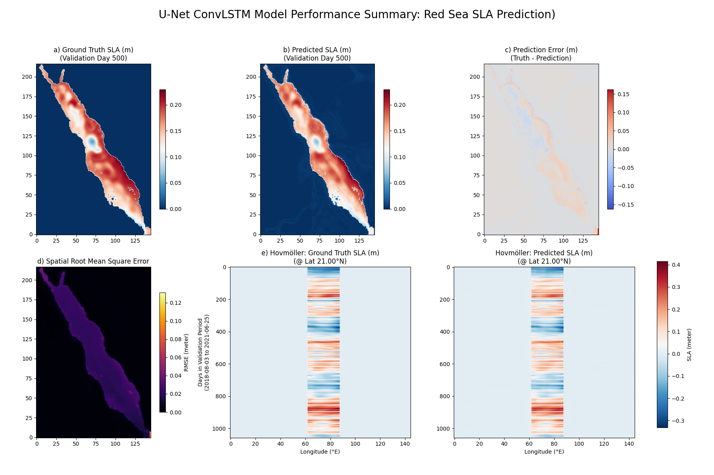

# Red Sea Eddy Forecasting using ConvLSTM U-Net


## Description

This project develops and evaluates a deep learning model for short-term prediction of mesoscale eddies in the Red Sea. It utilizes a Convolutional LSTM (ConvLSTM) U-Net architecture to forecast Sea Level Anomaly (SLA) 24 hours ahead, based on the previous 5 days of oceanographic (SLA, SST), atmospheric (Winds), and static (Bathymetry) data. The objective is to create an effective statistical forecasting tool for regional eddy dynamics relevant to research institutions. As an initial exploration into applying deep learning for oceanographic forecasting, this project represents a significant learning endeavor in integrating domain science with machine learning techniques.

## Key Result Visualization

The following image summarizes the performance of the final U-Net model (including bathymetry) on the validation set. It presents a prediction example alongside the ground truth and error map, the spatial distribution of Root Mean Squared Error (RMSE), and Hovmöller diagrams illustrating the model's capability to capture eddy propagation.


_[Image: Summary plot showing prediction example, spatial RMSE, and Hovmöller diagrams]_

## Installation and Setup

1.  **Clone Repository:**
    ```bash
    git clone [https://github.com/DDR-31/red-sea-eddy-forecast.git](https://github.com/DDR-31/red-sea-eddy-forecast.git)
    cd red-sea-eddy-forecast
    ```

2.  **Create Environment (Recommended):**
    ```bash
    python3 -m venv venv
    source venv/bin/activate # Linux/macOS
    # venv\Scripts\activate # Windows
    ```

3.  **Install Dependencies:**
    ```bash
    pip install -r requirements.txt
    ```

4.  **API Credentials:**
    * **Copernicus Marine (CMEMS):** Register an account at [data.marine.copernicus.eu](https://data.marine.copernicus.eu/register). Edit the `src/data_processing/01_download_cmems.py` script and insert your registered username and password.
    * **Copernicus Climate (CDS/ERA5):** Register an account at [cds.climate.copernicus.eu](https://cds.climate.copernicus.eu/user/register). Create a file named `.cdsapirc` in your system's home directory (`~/.cdsapirc` on Linux/macOS) containing your CDS API URL and key.

5.  **Bathymetry Data:**
    * Download the GEBCO gridded bathymetry dataset (e.g., GEBCO_2023, NetCDF format) covering the Red Sea region (approximately Latitude 10-32, Longitude 30-46) from the official [GEBCO website](https://www.gebco.net/data_and_products/gridded_bathymetry_data/).
    * Place the downloaded NetCDF file into the `data/raw/` directory within the project structure.
    * **Important:** Update the `GEBCO_FILENAME` variable within the `src/data_processing/04_merge_datasets.py` script to match the exact filename of the downloaded bathymetry data.

## Usage

Execute the following scripts **sequentially** from the project's root directory. Ensure all prerequisites (dependencies, credentials, data) are met before proceeding.

**1. Data Processing Pipeline:**
```bash
python src/data_processing/01_download_cmems.py
python src/data_processing/02_preprocess_data.py
python src/data_processing/03_download_era5.py
python src/data_processing/04_merge_datasets.py # Generates final_dataset_with_bathy.nc
```

**2. Modelling Pipeline**
# Calculate normalization statistics for all 5 input variables
python src/modelling/calculate_stats.py

# --- Adjust Batch Size ---
# Edit src/modelling/train_model.py
# Set BATCH_SIZE (e.g., 1 or 2) according to your available GPU VRAM.
# The U-Net model requires significant memory resources.
# -------------------------

# Train the U-Net ConvLSTM model using the processed data
python src/modelling/train_model.py # Saves the best model to models/convlstm_best.keras

# Generate visualizations summarizing model performance
python src/modelling/visualize_combined.py # Creates reports/combined_visualization.png

Data Sources
Ocean Data: CMEMS Global Ocean Physics Reanalysis (cmems_mod_glo_phy-cur_my_0.083_P1D-m). Variables utilized: zos (Sea Surface Height), thetao (Sea Surface Temperature). Data format: NetCDF. Requires CMEMS user registration.

Atmospheric Data: CDS ERA5 Reanalysis (reanalysis-era5-single-levels). Variables utilized: 10m_u_component_of_wind, 10m_v_component_of_wind. Data format: NetCDF. Requires CDS user registration.

Bathymetry Data: GEBCO Gridded Bathymetry Data (e.g., GEBCO_2023). Variable utilized: elevation. Data format: NetCDF. Publicly available for download.

Processed Data: The final merged and preprocessed dataset (final_dataset_with_bathy.nc), suitable for model training, is stored in the data/processed/ directory. Data format: NetCDF.

Methodology
Data Wrangling: Leveraged the xarray library for loading, selecting the surface layer, calculating Sea Level Anomaly (sla = zos - zos.mean(dim='time')), temporal alignment (reindex), spatial regridding (interp_like), dataset merging, and handling missing values (fillna).

Deep Learning Model: Implemented a ConvLSTM U-Net architecture using TensorFlow/Keras for spatio-temporal sequence-to-one prediction. The model forecasts sla at t+1 based on 5 input features (sla, thetao, u10, v10, bathy) from the preceding 5 days (t-4 to t).

Training Data Handling: Utilized a custom DataGenerator class (inheriting tf.keras.utils.Sequence) for efficient lazy-loading of large NetCDF datasets, performing on-the-fly Z-score normalization, and masking land pixels (nan values replaced with 0).

Model Training: Employed the Adam optimizer with a Mean Squared Error loss function. Incorporated Keras callbacks ModelCheckpoint (saving the best model based on validation loss) and EarlyStopping (halting training if validation loss plateaus).

Evaluation: Model performance was assessed through visual comparison of predicted SLA fields against ground truth, calculation of spatial Root Mean Squared Error (RMSE) maps, and analysis of Hovmöller diagrams to verify the prediction of eddy propagation dynamics.

Results
The trained ConvLSTM U-Net model demonstrates the capability to predict the location, general structure, and westward propagation of mesoscale eddies within the Red Sea 24 hours in advance.

The inclusion of bathymetry data as an input feature was observed to significantly reduce prediction errors along coastal boundaries, as quantitatively indicated by the spatial RMSE analysis.

The U-Net architecture produced visually sharper predictions with enhanced representation of spatial details compared to a simpler stacked ConvLSTM baseline model (evaluated visually and through preliminary spectral analysis).

The weights of the best performing U-Net model during training are saved in models/convlstm_best.keras.
